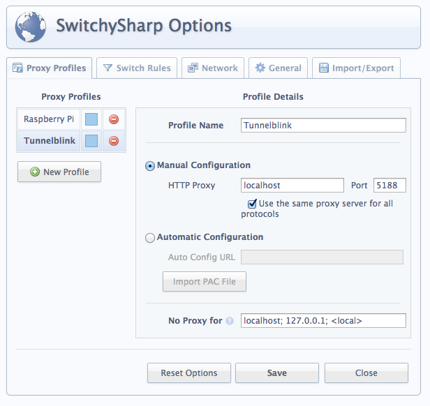

# Tunnelblink

## What is it?

A Vagrant setup to connect you to a VPN without using Tunnelblick. It instead uses a virtual machine running a HTTP proxy.

## Why would you want to do this?

You can connect to most things directly, while proxying only traffic that needs to go to the VPN through your new virtual machine.

## What do I do? (easy version)

You'll need to know your VPN name and password.

```
git clone git@github.com:cndreisbach/tunnelblink.git
cd tunnelblink
cp -r ~/Library/Application\ Support/Tunnelblick/Configurations/*.tblk .
mv *.tblk vpn.tblk
vagrant up
vagrant start-vpn
```

After the first time, it's just:

```
vagrant up
vagrant start-vpn
```

## Using the proxy

Turning on the VPN will not get you fully on the network. You'll need to actually use the proxy to tunnel your HTTP and HTTPS connections through. 

The host and port to use for your proxy is `localhost:5188`.

I use a Chrome plugin called [Proxy SwitchySharp](https://chrome.google.com/webstore/detail/proxy-switchysharp/dpplabbmogkhghncfbfdeeokoefdjegm) to set up my web proxies.

If you use this, you should set up a profile in the SwitchySharp options like this:



Jabber connections can use an HTTP proxy as well. Go into the settings for your inside-the-VPN Jabber chat and set it to use an HTTP proxy at `localhost:5188`.

## Using SSH

To SSH to something in the VPN, you'll need to edit your `.ssh/config`. From the Tunnelblink directory, run `vagrant ssh-config` to get instructions on what to add.

## Security

Running `vagrant start-vpn` very temporarily stores your username and password on disk before moving it to the `/tmp` directory on your virtual machine. If this worries you, do not use Tunnelblink.
